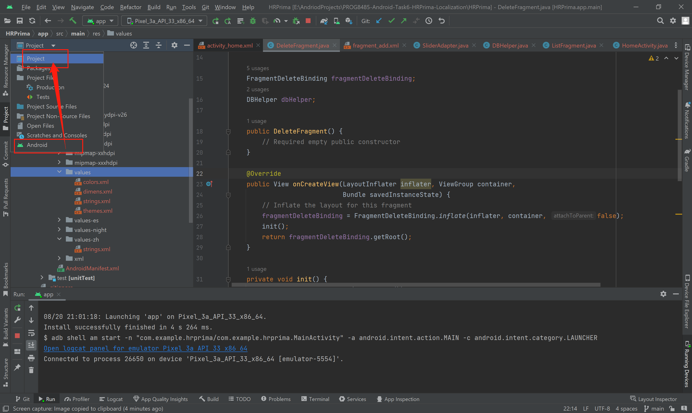
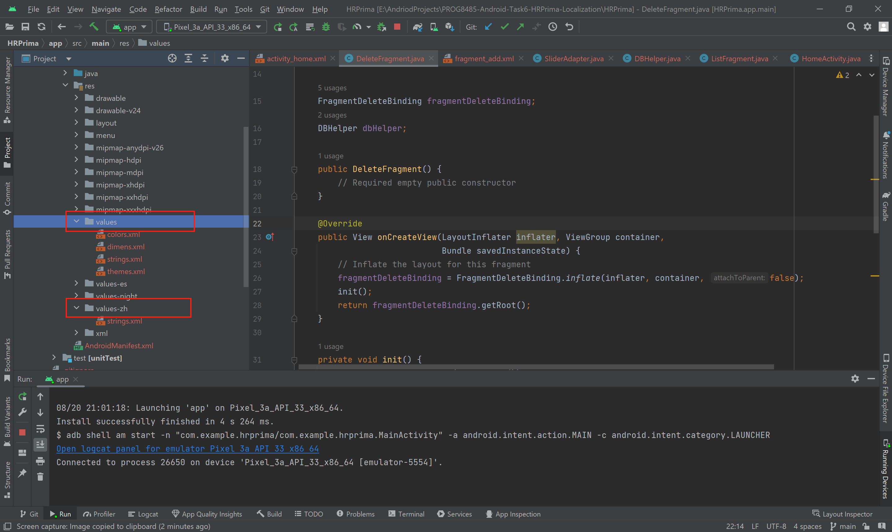
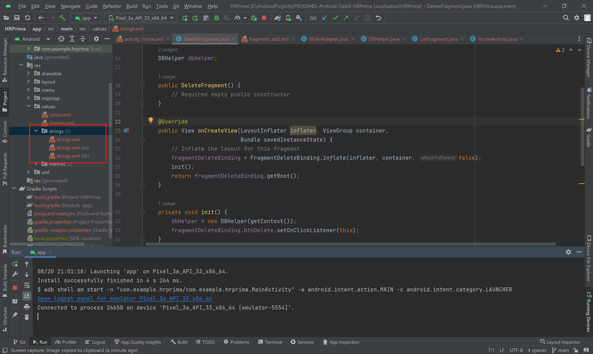
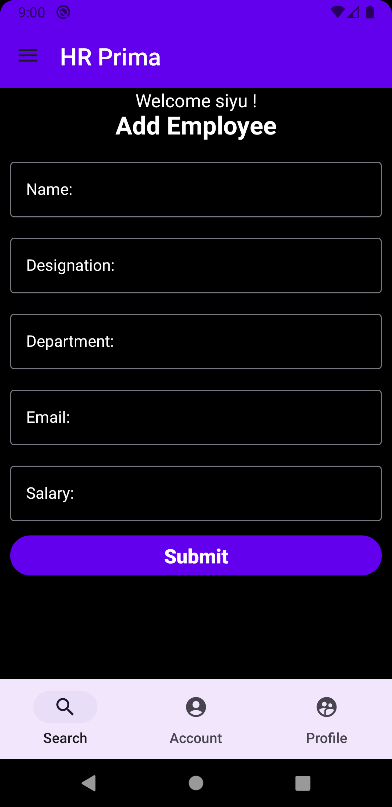
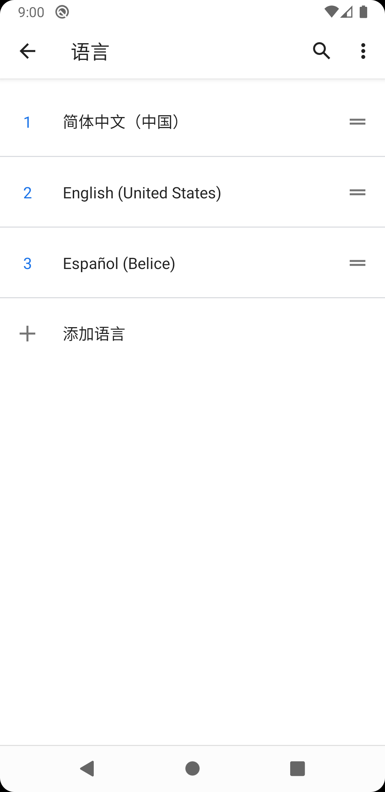
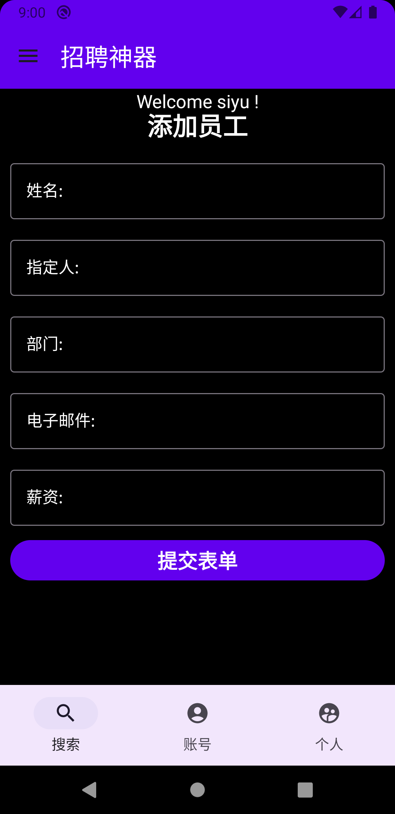

# PROG8485-Android-Task6-HRPrima-Localization

This project bases on the "HRPrima app" created in class. The main work of task 6 is making the "Add Employee" page support different languages. After editing the different versions values/strings.xml, now the app can display simplified Chinese.

## Project Structure

To create muti-language support, changing the project structure from Android to Project, then creating a new folder with language code (values-zh) means simplifed Chinese. Then create the strings.xml. (This is just one way for creating the strings.xml file)

If switch to the Android structure, the folder will be merged automatically, under the path: res > strings.xml > strings.xml(zh)

## Preview

